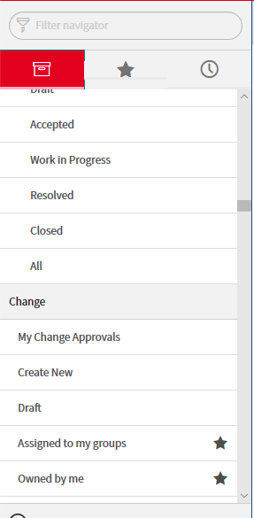
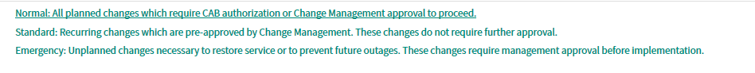
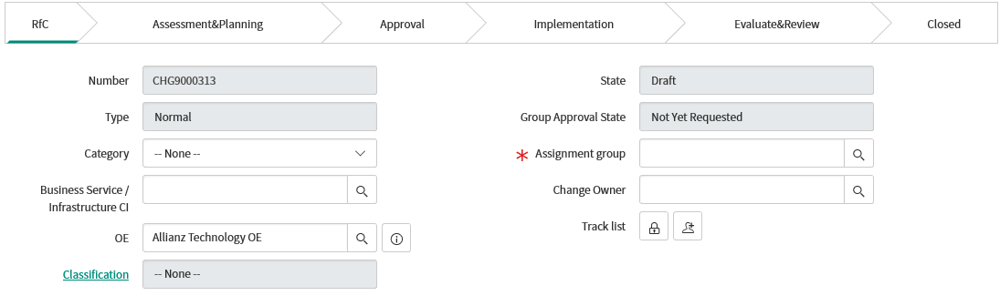
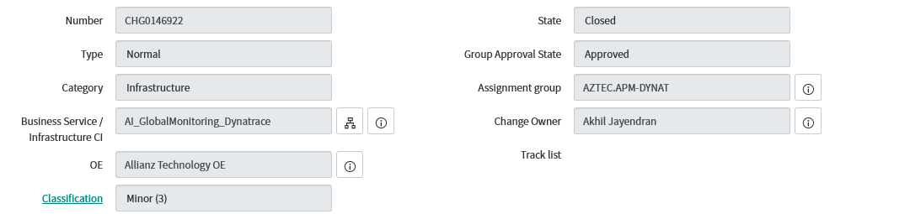
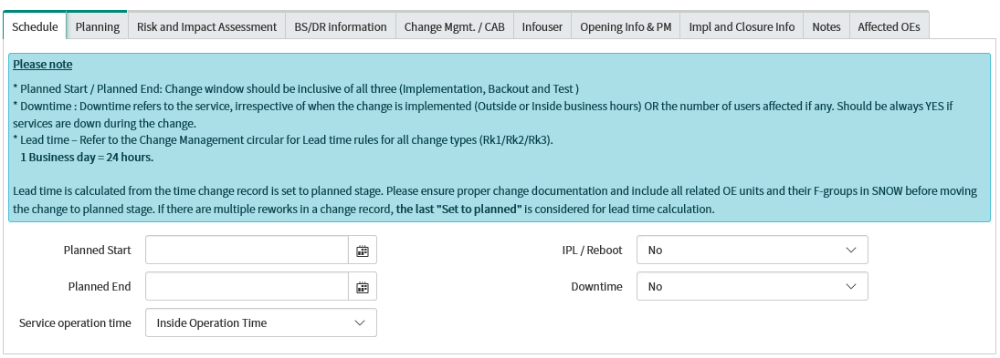
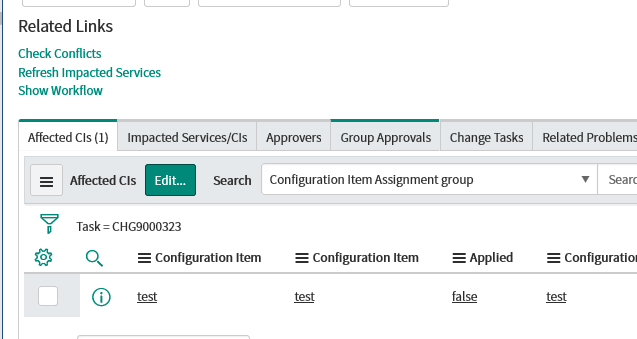
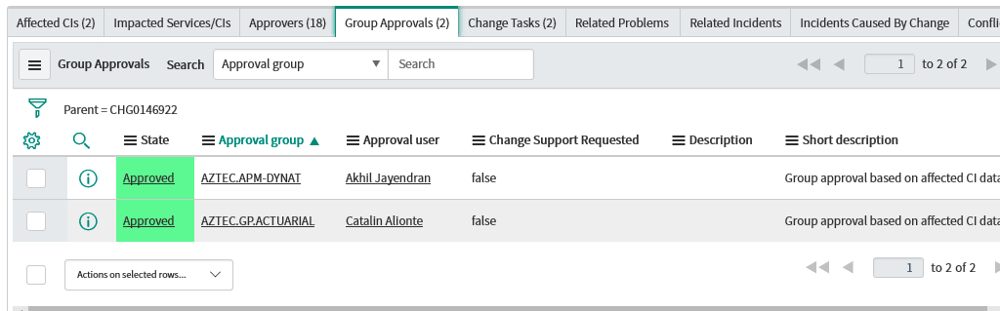

summary: How to open change in snow
id: snow
categories: snow 
tags: snow
status: Published 
authors: akhil

# Creating Change request in Allianz Servicenow

<!-- ------------------------ -->
## Overview
Duration: 30
### Introduction 

   - [Request for a change](#request-for-a-change-rfc-or-open-a-change-record )
   - [ Assessment and planning stage](#assessment-and-planning-stage)
   - [Approval Stage](#approval-stage)
   - [Implementation Stage](#implementation-stage)
   - [Close Change stage](#close-stage)
<!-- ------------------------ -->
## Request for a change (rfc) or open a Change record 
### open a Change record
Duration: 5 
1. Login to [Allianz Service Now](http://aztech.service-now.com ) 

2. Navigate the option to select `Change` --> `create new` option
 

.

    
3. Select the change template `Normal`

.

4. Select the below options as per the screenshot 
      - Category
      - Bussiness Service 
      - OE 
      - Assignemnet group
      - Change Owner 
   
.   

      you can use below example to fill data 

.

4. Fill the following 

    - Short description :
 
    `Add configuration lines to the hosts config of subsystem Dynatrace`
    
   - Requirements :
    ```
      1. Change Description (Please explain the change activity and its purpose in detail)
          	Add configuration lines to the hosts config of subsystem Dynatrace in order to install the agent automatically .
            
      2. Key contact during change implementation. (Name, Phone number, Email id)
		IBM.DS.UNIX.EUR  Allianz.UNIX.BAU@pl.ibm.com  and Global Monitroing team
      
      3. Which is/are the Affected/Related environment in this change . (Development, Test, Production) ?
		Production
      
      4. Which Application's / Services are affected/related ?
 		<team >
      
      5. Is this change related to CORE Data Center Network Devices ? Yes/No
		NO
      
      6. Have all the Affected Configuration Item's added in affected CI section? Yes/No
		Yes
      
      7. CI Type ( e.g - Server, DB, Mainframe, Router, Switches, Firewall . .etc.)
		Servers
      
      8. Critical time of implementation during the change window ?
		<Date and time >
      
      9. Are there any conflicts with any other parallel running changes ? YES/NO ?
               NO conflicts
               
     ```
     Note : you have to fill the data <>
 
      - Justfication :
    
         `Dynatrace Agent is required to monitor Application performance`
    
5. Under schedule tab update the planned start ,planned End dates ,Down time etc.

.

6. Under the Planning tab please update 

  	- Change plan 
	
	  ``` 
	  
	   Add the configuration lines to the hosts config of subsystem Dynatrace
           <HOSTNAME>:<ENVIRONMENT>:<HOSTGROUP>:<INSTALLMODE>:[<HOST-PROPERTY-LIST>] ( updated in the task )
           and
           Add the Dynatrace subsystem to the hosts and trigger a sysconf update.```
	
	
	
	- Backout plan
	
	` remove all configuration from host file`
	
	- Pre Implementation Tests
	
	 ` NA`
	 
	- Post Implementation Tests
	
	` Check all agents are connected successfully in Dynatrace GUI`
	
7. Update Risk and Assessment tab 

	- Impact assessment 

		`low`

	- Impact statement 

	    ``` • If the change fails, will there be any negative impact to the existing service functionality OR will the                       functionality remain the same as before ?
                                 No impact on exisiting service ,
                • Detailed description of the possible worst case scenario if the change fails.
                             no impact we can revert the chnage with in 15 mins
                • What needs to be done in the worst case scenario ?
                             uninstall the dynatrace agent ```
	
  	- Risk Assessment 
	  
	      `low'
	      
	- Risk Statement 
	
	    ``` • What is the probability of negative impact to services ?
			least probability
		• What risk mitigation steps have been taken to reduce the probability of impact?
			This agent is already installed and running in 100+ servers ```
8. Now we have to set the change to Registered   by clicking the button in top left corner .

	

9. Once the change is registred please assigned the change to yourself .

	
<!-- ------------------------ -->

 
 ## Assessment and planning stage
 ### Assessment and planning stage
 Duration: 5
 
1. BS/DR information  tab update :
 
 	- Business Service Update 
	
		`NO`
		
	- Disaster Recovery Plan 
	
	        `NO`
		
2. Select Change Management / CAB unit 
 
           `AMOS.CHG-CHG_MGMT`

3.  Add the server names which you want to install agent in the bottom of change window by clicking the edit button

   
   
 4. Based on the selected CI there will be some approval task will be added in the group approval tab .Please check and        confirm the same .
 
  
  
 5. Now add the task to IBM for installing Agent 
 
 	- Task Type :
	
	    ` Implementation task `
	    
	- Planned Start Date 
	
	    `According to your change `
	    	    
	- Planned End Date 
	
	    `According to your change `
	    
	- Assignment Group 
	
	     ` IBM.DS.UNIX.EUR`
	     
	 - Short description
	      
	       `Add Dynatrace hosts  in SYSCONF`
	  
	 - Requirement 
	 
	    ```
	    Setp 1: Add following configuration lines to the hosts config of subsystem Dynatrace 
	    	    (Location:OS_independent/filedir.sc/tmp/dynatrace/hosts.txt)
                   <HOSTNAME>:<ENVIRONMENT>:<HOSTGROUP>:<INSTALLMODE>:[<HOST-PROPERTY-LIST>]
 	   Step 2:  Add the Dynatrace subsystem to the hosts and trigger a sysconf update.(eg below) 
		    sla27334.srv.allianz:prod:az-tech-rap-argo:full:		        [ProfitCenter=C49,CostCenter=tbd,ServiceID=8000142,Department=A-GP03RAP]
	   
	    Step3 : Check Ps-eaf |grep -i Dynatrace ( to confim the agent is running fine )
	    
	    Step4 : contact Change owner and confirm the agent is successfully registred in Dynatrace
	    
	    ```
6. Now Set the change to planned state .

   
   
7. Work with diffrent team ( group approval tab ) get the approval .Once we got all approval set the change to accepted state .  Meanwhile we should also confim IBM also Accepted our change task 

 
 
<!-- ------------------------ --> 
 ## Approval stage 
 ### Approval stage 
Duration: 5
 
 1. In this stage we will required approval from allianz change Management team . Change team will review our change .In case if we have any quries they will send you an email . Once they are accepted we are ready to move the change to Implementation Stage .
 <!-- ------------------------ -->
 ## Implementation Stage 
 ### Implementation Stage 
 Duration: 5
 1. Now we are ready to perform the change .Once you completed the  task  please update the task with close state .
 <!-- ------------------------ -->
 ## Close stage 
 ### Close stage 
 Duration: 2
 1. Close the change .
<!-- ------------------------ -->
	   
		

